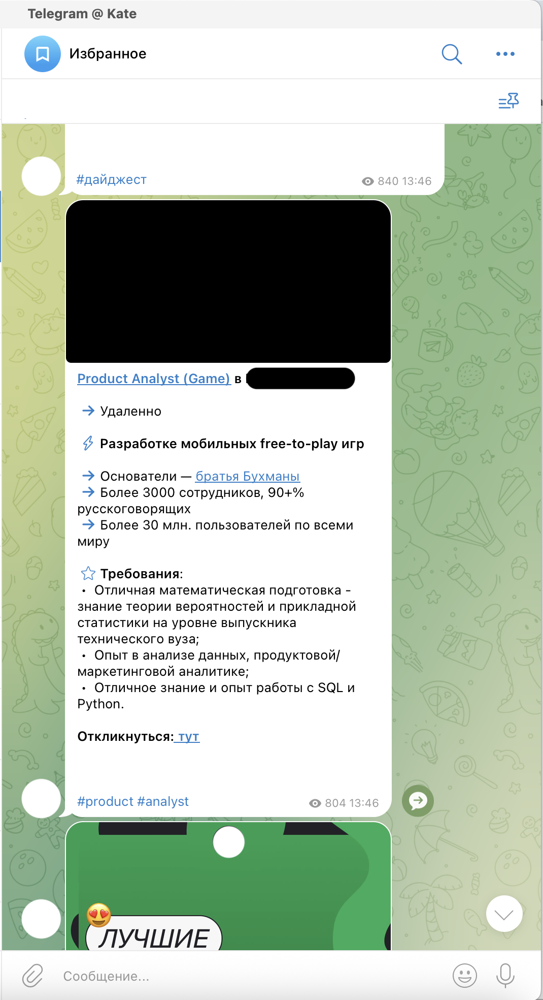

# Telegram Vacancy Monitor

> A Python script that automates job hunting by monitoring Telegram channels for relevant vacancies and forwarding matches to your Saved Messages.

🇬🇧 [English](#english) · 🇷🇺 [Русский](#русский)

---

## English

### About

I was actively job hunting and got tired of manually scrolling through 50+ Telegram channels every day. So I built this script — it watches the channels for me, filters out the noise by keywords, and forwards only relevant vacancies to my Saved Messages. Now I check one chat instead of fifty.

### Demo

Forwarded vacancies in Saved Messages:


<br clear="left">

### Features

- Monitors any number of public and private Telegram channels in real time
- Filters messages by configurable keywords (e.g. `data analyst`, `remote`, `Python`)
- Optional negative keywords to exclude unwanted matches (e.g. `senior`, `on-site`)
- Forwards matches to Saved Messages (or any chat you specify)
- Works on any machine with Python — laptop, Raspberry Pi, or a free cloud VM

### Tech Stack

- **Python 3.10+**
- **[Telethon](https://docs.telethon.dev/)** — async Telegram client library

### Installation

```bash
# Clone the repo
git clone https://github.com/katpvlv/telegram-vacancy-monitor.git
cd telegram-vacancy-monitor

# Create a virtual environment (recommended)
python -m venv venv
source venv/bin/activate   # on Windows: venv\Scripts\activate

# Install dependencies
pip install -r requirements.txt
```

### Configuration

1. **Get Telegram API credentials**
   Go to [my.telegram.org](https://my.telegram.org) → API Development Tools → create a new application. Save your `api_id` and `api_hash`.

2. **Open `main.py`** and fill in the settings block at the top:

   ```python
   API_ID = 1234567
   API_HASH = "your_api_hash_here"
   PHONE = "+1234567890"

   CHANNELS = ["channel_username_1", "channel_username_2"]
   KEYWORDS = ["data analyst", "remote"]
   NEGATIVE_KEYWORDS = ["senior", "lead"]
   ```

### Usage

```bash
python main.py
```

On the first run, Telegram will ask for the SMS code to authenticate. A `.session` file will be created — keep it (and don't commit it to Git — it's already in `.gitignore`).

The script runs continuously and forwards matching messages as they arrive.

### Project Structure

```
telegram-vacancy-monitor/
├── main.py              # The script — settings at the top, logic below
├── requirements.txt
├── .gitignore
├── LICENSE
└── README.md
```

### Why I Built This

I'm transitioning into data analytics and was applying to a lot of positions. Manual channel monitoring was eating 1–2 hours a day. This script cut that to 10 minutes and I never miss a vacancy now.

It's also a small piece of my portfolio: Python, async programming, API integration, practical automation.

### License

MIT — see [LICENSE](LICENSE).

---

## Русский

### О проекте

Во время поиска работы одним из важных инструментов оказался Telegram. В моей папке с вакансиями сейчас лежит около 50 каналов и их ежедневный мониторинг занимает около одного часа каждый день. Поэтому я написала скрипт, который сам читает каналы, отсекает нерелевантные сообщения и кидает подходящие вакансии в Избранное. 

### Демо

Отфильтрованные вакансии в Избранном:


<br clear="left">

### Возможности

- Мониторит любое количество публичных и приватных Telegram-каналов в реальном времени
- Фильтрует сообщения по настраиваемым ключевым словам (например, `data analyst`, `remote`, `Python`)
- Опциональные минус-слова для исключения нерелевантных матчей (например, `senior`, `офис`)
- Пересылает совпадения в Избранное (или любой указанный чат)
- Работает на любой машине с Python (ноутбук, Raspberry Pi или бесплатная облачная VM)

### Стек

- **Python 3.10+**
- **[Telethon](https://docs.telethon.dev/)** — асинхронная библиотека для работы с Telegram API

### Установка

```bash
# Клонировать репозиторий
git clone https://github.com/katpvlv/telegram-vacancy-monitor.git
cd telegram-vacancy-monitor

# Создать виртуальное окружение (рекомендуется)
python -m venv venv
source venv/bin/activate   # на Windows: venv\Scripts\activate

# Установить зависимости
pip install -r requirements.txt
```

### Настройка

1. **Получить API-ключи Telegram**
   Зайти на [my.telegram.org](https://my.telegram.org) → API Development Tools → создать новое приложение. Сохранить `api_id` и `api_hash`.

2. **Открыть `main.py`** и заполнить блок настроек вверху файла:

   ```python
   API_ID = 1234567
   API_HASH = "ваш_api_hash"
   PHONE = "+1234567890"

   CHANNELS = ["channel_username_1", "channel_username_2"]
   KEYWORDS = ["data analyst", "удалённо"]
   NEGATIVE_KEYWORDS = ["senior", "офис"]
   ```

### Запуск

```bash
python main.py
```

При первом запуске Telegram попросит ввести SMS-код для авторизации. Создастся файл `.session`, его нужно сохранить (и не коммитить в Git, он уже в `.gitignore`).

Скрипт работает непрерывно и пересылает совпадения по мере их появления.

### Структура проекта

```
telegram-vacancy-monitor/
├── main.py              # Сам скрипт — настройки сверху, логика ниже
├── requirements.txt
├── .gitignore
├── LICENSE
└── README.md
```

### Зачем я это сделала

Перехожу в аналитику данных и активно откликаюсь на позиции. Ручной мониторинг каналов отнимал 1–2 часа в день. Скрипт сократил это до 10 минут, теперь ни одна вакансия не проходит мимо.

Это также небольшая часть моего портфолио: Python, асинхронное программирование, работа с API, практическая автоматизация.

### Лицензия

MIT — см. [LICENSE](LICENSE).
